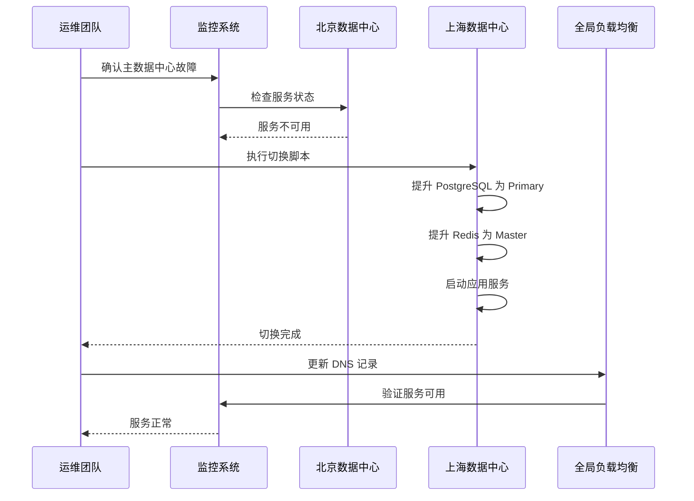

# 多数据中心异地灾备架构设计文档

## 1. 概述

### 1.1 目标
本文档定义 Industrial AI Platform 的多数据中心异地灾备方案，确保：
- **RTO (恢复时间目标)** < 5 分钟
- **RPO (恢复点目标)** < 15 分钟
- 数据零丢失或最小化丢失
- 自动化故障切换能力

### 1.2 架构概览

```
┌─────────────────────────────────────────────────────────────────┐
│                     主数据中心 (北京 - DC-BJ)                     │
│  ┌──────────────┐  ┌──────────────┐  ┌──────────────┐          │
│  │ PostgreSQL   │  │    Redis     │  │   App Pods   │          │
│  │   Primary    │  │   Primary    │  │   (Active)   │          │
│  └──────┬───────┘  └──────┬───────┘  └──────────────┘          │
│         │                 │                                       │
│         │ 流复制          │ 双向同步                               │
│         │                 │                                       │
└─────────┼─────────────────┼───────────────────────────────────────┘
          │                 │
          │   专用线路/VPN   │
          │   (低延迟专线)   │
          │                 │
┌─────────┼─────────────────┼───────────────────────────────────────┐
│         │                 │                                       │
│         │ 逻辑复制        │                                       │
│         ▼                 ▼                                       │
│  ┌──────────────┐  ┌──────────────┐  ┌──────────────┐          │
│  │ PostgreSQL   │  │    Redis     │  │   App Pods   │          │
│  │  Standby     │  │   Standby    │  │  (Standby)   │          │
│  └──────────────┘  └──────────────┘  └──────────────┘          │
│                                                                   │
│                     灾备数据中心 (上海 - DC-SH)                    │
└─────────────────────────────────────────────────────────────────┘

                    ┌──────────────┐
                    │   全局负载   │
                    │  均衡器 GSLB │
                    └──────┬───────┘
                           │
              ┌────────────┴────────────┐
              │                         │
        北京 DNS 记录               上海 DNS 记录
        (优先级 10)                 (优先级 20)
```

## 2. 数据中心拓扑

### 2.1 主数据中心 - 北京 (DC-BJ)

| 组件 | 配置 | 角色 |
|------|------|------|
| PostgreSQL | 3节点 Patroni 集群 | Primary |
| Redis | 3节点 Sentinel 集群 | Primary |
| App Server | Kubernetes 集群 (3+节点) | Active |
| TimescaleDB | 已启用 | Primary |
| 监控 | Prometheus + Grafana | Active |

**网络配置:**
```
CIDR: 10.1.0.0/16
PostgreSQL VIP: 10.1.1.10
Redis VIP: 10.1.1.20
App LB: 10.1.1.100
```

### 2.2 灾备数据中心 - 上海 (DC-SH)

| 组件 | 配置 | 角色 |
|------|------|------|
| PostgreSQL | 3节点 Patroni 集群 | Hot Standby |
| Redis | 3节点 Sentinel 集群 | Replica |
| App Server | Kubernetes 集群 (3+节点) | Standby |
| TimescaleDB | 已启用 | Replica |
| 监控 | Prometheus + Grafana | Standby |

**网络配置:**
```
CIDR: 10.2.0.0/16
PostgreSQL VIP: 10.2.1.10
Redis VIP: 10.2.1.20
App LB: 10.2.1.100
```

## 3. 数据复制策略

### 3.1 PostgreSQL 复制架构

#### 3.1.1 同数据中心复制 (高可用)
- **方式**: 同步流复制 (Synchronous Streaming Replication)
- **节点**: 1 Primary + 2 Standby
- **模式**: synchronous_commit = on
- **故障切换**: Patroni 自动管理 (30秒内)

#### 3.1.2 跨数据中心复制 (灾备)
- **方式**: 异步逻辑复制 (Asynchronous Logical Replication)
- **订阅**: PostgreSQL 内置逻辑复制
- **延迟**: < 5秒 (正常情况)
- **数据丢失风险**: < 15分钟数据

**复制配置要点:**
```sql
-- 主数据中心发布
CREATE PUBLICATION cross_dc_publication 
FOR ALL TABLES;

-- 灾备数据中心订阅
CREATE SUBSCRIPTION cross_dc_subscription
    CONNECTION 'host=dc-bj-postgres-primary user=replicator password=xxx'
    PUBLICATION cross_dc_publication
    WITH (copy_data = true, create_slot = true);
```

### 3.2 Redis 复制架构

#### 3.2.1 同数据中心复制
- **方式**: 哨兵模式 (Sentinel)
- **节点**: 1 Master + 2 Replica + 3 Sentinel
- **故障切换**: Sentinel 自动管理 (30秒内)

#### 3.2.2 跨数据中心同步
- **方式**: Redis 双向同步 + CRDT 冲突解决
- **工具**: Redis-CRDT 或自研同步脚本
- **延迟**: < 5秒
- **冲突策略**: Last-Write-Wins with Timestamp

### 3.3 TimescaleDB 连续聚合

由于 TimescaleDB 基于 PostgreSQL，遵循 PostgreSQL 逻辑复制：
```sql
-- 确保 hypertable 被复制
SELECT set_replication_role('device_telemetry', 'replica');
```

## 4. 网络与连接

### 4.1 数据中心互联

| 连接类型 | 带宽 | 延迟 | 用途 |
|---------|------|------|------|
| 专线 | 1 Gbps | < 10ms | 数据库复制 |
| VPN 备用 | 100 Mbps | < 50ms | 故障备用 |
| 公网 | 50 Mbps | < 100ms | 监控/告警 |

### 4.2 防火墙规则

```
# PostgreSQL 复制端口
DC-BJ (10.1.0.0/16) -> DC-SH (10.2.0.0/16):5432 ALLOW
DC-SH (10.2.0.0/16) -> DC-BJ (10.1.0.0/16):5432 ALLOW

# Redis 同步端口
DC-BJ (10.1.0.0/16) -> DC-SH (10.2.0.0/16):6379,26379 ALLOW
DC-SH (10.2.0.0/16) -> DC-BJ (10.1.0.0/16):6379,26379 ALLOW
```

## 5. 故障切换流程

### 5.1 自动故障切换 (数据中心内)

**触发条件:**
- Primary 节点心跳丢失 (连续 3 次)
- 同步复制延迟 > 10秒

**切换流程:**
```
1. Patroni/Sentinel 检测到 Primary 故障
2. 自动选举新 Primary (基于优先级和数据完整性)
3. 更新 VIP 绑定
4. 应用自动重连 (通过 VIP)
5. 发送告警通知
```

**恢复时间:** < 30秒

### 5.2 手动灾备切换 (跨数据中心)

**触发条件:**
- 主数据中心完全不可用
- 计划性维护
- 主数据中心网络隔离

**切换流程:**



**详细步骤:**

1. **准备阶段 (1分钟)**
   - 确认主数据中心状态
   - 通知相关团队
   - 准备切换脚本

2. **执行阶段 (2分钟)**
   ```bash
   # 在灾备数据中心执行
   ./scripts/disaster-recovery.sh switch-to-dr
   ```

3. **验证阶段 (1分钟)**
   - 验证数据库读写
   - 验证应用服务
   - 验证监控告警

4. **DNS 切换 (1分钟)**
   - 更新 GSLB DNS 记录
   - 等待 TTL 过期 (预设 60秒)

**总恢复时间:** < 5分钟

### 5.3 回切流程 (恢复主数据中心)

**前提条件:**
- 主数据中心服务恢复
- 数据同步完成
- 网络连接正常

**回切步骤:**
```bash
# 1. 验证主数据中心服务
./scripts/disaster-recovery.sh verify dc-bj

# 2. 同步数据差异
./scripts/cross-dc-sync.sh sync-to-dc dc-bj

# 3. 执行回切
./scripts/disaster-recovery.sh switch-back dc-bj

# 4. 验证服务
./scripts/disaster-recovery.sh verify dc-bj
```

## 6. 数据一致性保障

### 6.1 一致性级别

| 数据类型 | 一致性要求 | 复制方式 | RPO |
|---------|-----------|---------|-----|
| 用户数据 | 强一致性 | 同步复制 | 0 |
| 设备遥测 | 最终一致性 | 异步复制 | < 5秒 |
| 告警配置 | 强一致性 | 同步复制 | 0 |
| 会话数据 | 最终一致性 | 异步复制 | < 15秒 |

### 6.2 数据校验

**定期校验脚本:**
```bash
# 每日执行
./scripts/cross-dc-sync.sh verify-data
```

**校验内容:**
- 表行数一致性
- 关键数据 MD5 校验
- 时间戳差异检查

### 6.3 冲突解决策略

**Redis 双向同步冲突:**
- 基于 timestamp 的 Last-Write-Wins
- 冲突日志记录
- 手动修复接口

**PostgreSQL 复制冲突:**
- 逻辑复制自动解决 (主键冲突跳过)
- 错误日志记录
- DBA 手动干预

## 7. 监控与告警

### 7.1 监控指标

| 指标 | 阈值 | 告警级别 |
|------|------|---------|
| PostgreSQL 复制延迟 | > 5秒 | Warning |
| PostgreSQL 复制延迟 | > 30秒 | Critical |
| Redis 主从延迟 | > 3秒 | Warning |
| 跨数据中心网络延迟 | > 50ms | Warning |
| 数据中心健康检查失败 | 1次 | Critical |

### 7.2 健康检查端点

```
GET /health/db        # 数据库健康
GET /health/redis    # Redis 健康
GET /health/replication  # 复制状态
GET /health/dc       # 数据中心状态
```

### 7.3 告警通知

**告警渠道:**
- 企业微信/钉钉机器人
- 邮件通知
- 短信通知 (Critical级别)

**告警规则:** 见 `infra/prometheus/cross-dc-alert-rules.yml`

## 8. 灾备演练

### 8.1 演练计划

| 演练类型 | 频率 | 参与人员 | 预期时间 |
|---------|------|---------|---------|
| 数据库故障切换 | 每月 | DBA团队 | 30分钟 |
| 应用服务切换 | 每季度 | 运维团队 | 1小时 |
| 完整灾备切换 | 每半年 | 全体团队 | 2小时 |

### 8.2 演练记录模板

```markdown
## 灾备演练记录

**日期**: YYYY-MM-DD
**类型**: [数据库切换/应用切换/完整切换]
**参与人员**: 
**开始时间**: 
**结束时间**: 
**RTO**: 
**RPO**: 
**发现问题**: 
**改进措施**: 
```

## 9. 应急响应

### 9.1 应急预案

**Level 1 - 单节点故障:**
- 自动恢复
- 5分钟内通知

**Level 2 - 集群故障:**
- 自动切换同数据中心备用节点
- 10分钟内通知

**Level 3 - 数据中心故障:**
- 手动触发灾备切换
- 立即通知管理层
- 启动应急响应团队

### 9.2 应急联系人

| 角色 | 姓名 | 联系方式 | 职责 |
|-----|------|---------|------|
| 应急指挥 | - | - | 总体决策 |
| DBA负责人 | - | - | 数据库切换 |
| 运维负责人 | - | - | 应用切换 |
| 网络负责人 | - | - | 网络切换 |

## 10. 成本估算

### 10.1 资源配置

| 资源 | 北京 | 上海 | 月费用估算 |
|-----|------|------|-----------|
| PostgreSQL | 3x 8C32G | 3x 8C32G | ¥24,000 |
| Redis | 3x 4C16G | 3x 4C16G | ¥12,000 |
| 应用服务器 | 3x 4C8G | 3x 4C8G | ¥9,000 |
| 存储 | 500GB SSD | 500GB SSD | ¥3,000 |
| 网络专线 | - | - | ¥5,000 |
| **总计** | | | **¥53,000/月** |

### 10.2 ROI 分析

- 数据丢失风险降低: 99.9%
- 服务可用性提升: 99.99% (52分钟/年)
- 故障恢复时间: 从小时级降至分钟级

## 11. 实施计划

### 11.1 阶段一：基础设施建设 (2周)
- [ ] 上海数据中心服务器部署
- [ ] 网络专线/VPC互联配置
- [ ] 防火墙规则配置

### 11.2 阶段二：数据库复制 (1周)
- [ ] PostgreSQL 跨DC复制配置
- [ ] Redis 跨DC同步配置
- [ ] 复制状态验证

### 11.3 阶段三：应用部署 (1周)
- [ ] 应用服务部署
- [ ] 监控系统部署
- [ ] 健康检查配置

### 11.4 阶段四：测试与演练 (1周)
- [ ] 故障切换测试
- [ ] 灾备演练
- [ ] 文档完善

## 12. 附录

### 12.1 配置文件清单

- `infra/postgresql/cross-dc-replication.conf` - PostgreSQL 跨DC复制配置
- `infra/redis/cross-dc-sync.md` - Redis 跨DC同步方案
- `infra/prometheus/cross-dc-alert-rules.yml` - 告警规则

### 12.2 脚本清单

- `scripts/cross-dc-sync.sh` - 数据同步脚本
- `scripts/disaster-recovery.sh` - 灾备切换脚本

### 12.3 参考文档

- [PostgreSQL 逻辑复制文档](https://www.postgresql.org/docs/current/logical-replication.html)
- [Redis 复制文档](https://redis.io/docs/management/replication/)
- [Patroni 高可用方案](https://patroni.readthedocs.io/)
- [TimescaleDB 复制](https://docs.timescale.com/timescaledb/latest/overview/replication-and-ha/)